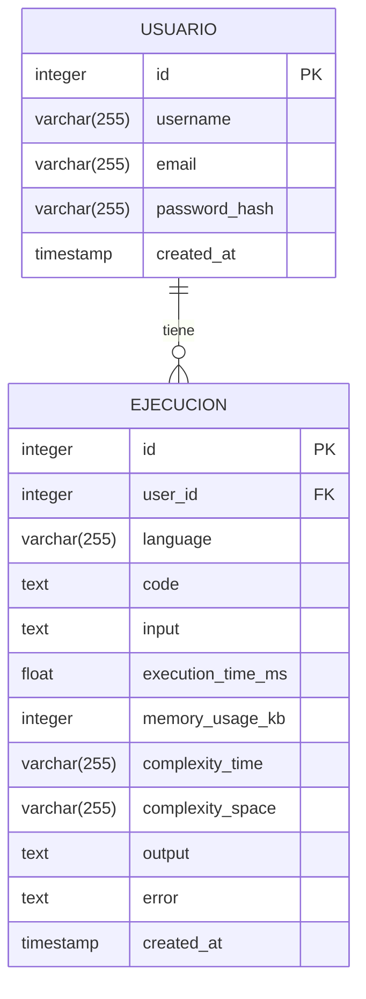

# Documento de Modelado de la Base de Datos (PostgreSQL)

## 1. Introducción

Este documento define el modelo de datos para la base de datos PostgreSQL de Argus. Se detallan las tablas, columnas, tipos de datos, relaciones y restricciones necesarias para almacenar la información de los usuarios, las ejecuciones de código y los resultados.

## 2. Diagrama Entidad-Relación (ERD)



## 3. Tablas

### 3.1. Tabla `usuarios`

Almacena la información de los usuarios registrados.

| Columna         | Tipo de Dato     | Restricciones                               | Descripción                                                                 |
| :-------------- | :--------------- | :------------------------------------------ | :-------------------------------------------------------------------------- |
| `id`            | `INTEGER`        | `PRIMARY KEY`, `GENERATED ALWAYS AS IDENTITY` | Identificador único del usuario.                                            |
| `username`      | `VARCHAR(255)`   | `NOT NULL`, `UNIQUE`                         | Nombre de usuario (único).                                                   |
| `email`         | `VARCHAR(255)`   | `NOT NULL`, `UNIQUE`                         | Dirección de correo electrónico (única).                                      |
| `password_hash` | `VARCHAR(255)`   | `NOT NULL`                                  | Hash de la contraseña (generado con bcrypt).                                |
| `created_at`    | `TIMESTAMP`      | `NOT NULL DEFAULT CURRENT_TIMESTAMP`         | Fecha y hora de creación del usuario.                                       |

### 3.2. Tabla `ejecuciones`

Almacena la información de cada ejecución de código.

| Columna             | Tipo de Dato     | Restricciones                               | Descripción                                                                                   |
| :------------------ | :--------------- | :------------------------------------------ | :-------------------------------------------------------------------------------------------- |
| `id`                | `INTEGER`        | `PRIMARY KEY`, `GENERATED ALWAYS AS IDENTITY` | Identificador único de la ejecución.                                                        |
| `user_id`           | `INTEGER`        | `NULLABLE`, `FOREIGN KEY` referencing `usuarios.id` `ON DELETE SET NULL` `ON UPDATE CASCADE` | Identificador del usuario que realizó la ejecución (puede ser NULL si no está autenticado). |
| `language`          | `VARCHAR(255)`   | `NOT NULL`                                  | Lenguaje de programación del código.                                                          |
| `code`              | `TEXT`           | `NOT NULL`                                  | Código fuente ejecutado.                                                                      |
| `input`             | `TEXT`           |  *(Sin restricción NOT NULL)*              | Datos de entrada proporcionados al código (opcional).                                            |
| `execution_time_ms` | `FLOAT`          |                                             | Tiempo de ejecución en milisegundos.                                                             |
| `memory_usage_kb`   | `INTEGER`        |                                             | Uso máximo de memoria en kilobytes.                                                               |
| `complexity_time`   | `VARCHAR(255)`   |                                             | Complejidad temporal estimada (Big O).                                                            |
| `complexity_space`  | `VARCHAR(255)`   |                                             | Complejidad espacial estimada (Big O).                                                             |
| `output`            | `TEXT`           |                                             | Salida estándar (stdout) del código.                                                              |
| `error`             | `TEXT`           |                                             | Error estándar (stderr) del código (si lo hay).                                                    |
| `created_at`        | `TIMESTAMP`      | `NOT NULL DEFAULT CURRENT_TIMESTAMP`         | Fecha y hora de la ejecución.                                                                  |

## 4. Índices

*   **Tabla `usuarios`:**
    *   Índice único en la columna `email`.
    *   Índice único en la columna `username`.
*   **Tabla `ejecuciones`:**
    *   Índice en la columna `user_id` (para buscar rápidamente las ejecuciones de un usuario).
    *   Índice en la columna `created_at` (para ordenar las ejecuciones por fecha).
    *   Índice en la columna `language`.

## 5. Consideraciones Adicionales

*   **`GENERATED ALWAYS AS IDENTITY`:** Se utiliza para que la base de datos genere automáticamente los valores de las claves primarias (`id`).
*   **`DEFAULT CURRENT_TIMESTAMP`:** Se utiliza para que la base de datos registre automáticamente la fecha y hora de creación.
*   **Tipos de Datos:** Se han elegido tipos de datos apropiados para cada columna (`VARCHAR`, `TEXT`, `INTEGER`, `FLOAT`, `TIMESTAMP`).
*   **Normalización:** La base de datos está, al menos, en la tercera forma normal (3NF).
*  **`user_id` nullable:**  La columna `user_id` en `ejecuciones` ahora permite valores `NULL`.
* **`ON DELETE SET NULL` y `ON UPDATE CASCADE`:**  Si un usuario se elimina, el `user_id` de sus ejecuciones se establece en `NULL`. Si el `id` de un usuario se actualiza, el `user_id` de sus ejecuciones también se actualiza.

## 6. Migraciones (Ejemplo con Sequelize)

Aquí tienes ejemplos completos de migraciones con Sequelize para crear las tablas `usuarios` y `ejecuciones`:

```javascript
// migrations/[timestamp]-create-users.js
'use strict';

module.exports = {
  up: async (queryInterface, Sequelize) => {
    await queryInterface.createTable('usuarios', {
      id: {
        allowNull: false,
        autoIncrement: true,
        primaryKey: true,
        type: Sequelize.INTEGER,
        generated: 'ALWAYS', // O generated: true si usas una version anterior
      },
      username: {
        type: Sequelize.STRING(255), // Usar tipo de dato con longitud
        allowNull: false,
        unique: true,
      },
      email: {
        type: Sequelize.STRING(255), // Usar tipo de dato con longitud
        allowNull: false,
        unique: true,
      },
      password_hash: {
        type: Sequelize.STRING(255), // Usar tipo de dato con longitud
        allowNull: false,
      },
      created_at: {
        allowNull: false,
        type: Sequelize.DATE,
        defaultValue: Sequelize.literal('CURRENT_TIMESTAMP'),
      },
    });

    // Añadir índices
    await queryInterface.addIndex('usuarios', ['email'], { unique: true });
    await queryInterface.addIndex('usuarios', ['username'], { unique: true });

  },

  down: async (queryInterface, Sequelize) => {
    await queryInterface.dropTable('usuarios');
  },
};
```

```javascript
// migrations/[timestamp]-create-ejecuciones.js
'use strict';

module.exports = {
  up: async (queryInterface, Sequelize) => {
    await queryInterface.createTable('ejecuciones', {
      id: {
        allowNull: false,
        autoIncrement: true,
        primaryKey: true,
        type: Sequelize.INTEGER,
        generated: 'ALWAYS',  // o generated: true si usas una version anterior
      },
      user_id: {
        type: Sequelize.INTEGER,
        allowNull: true, // Permitir NULL
        references: {
          model: 'usuarios', // Nombre de la tabla (en plural, según convención de Sequelize)
          key: 'id',
        },
        onUpdate: 'CASCADE', // Actualizar en cascada
        onDelete: 'SET NULL', // Establecer a NULL si el usuario se elimina
      },
      language: {
        type: Sequelize.STRING(255), // Usar tipo de dato con longitud
        allowNull: false,
      },
      code: {
        type: Sequelize.TEXT,
        allowNull: false,
      },
      input: {
        type: Sequelize.TEXT, // Sin restricción NOT NULL
      },
      execution_time_ms: {
        type: Sequelize.FLOAT,
      },
      memory_usage_kb: {
        type: Sequelize.INTEGER,
      },
      complexity_time: {
        type: Sequelize.STRING(255), // Usar tipo de dato con longitud
      },
      complexity_space: {
        type: Sequelize.STRING(255), // Usar tipo de dato con longitud
      },
      output: {
        type: Sequelize.TEXT,
      },
      error: {
        type: Sequelize.TEXT,
      },
      created_at: {
        allowNull: false,
        type: Sequelize.DATE,
        defaultValue: Sequelize.literal('CURRENT_TIMESTAMP'),
      },
    });

    //Añadir indices
    await queryInterface.addIndex('ejecuciones', ['user_id']);
    await queryInterface.addIndex('ejecuciones', ['created_at']);
    await queryInterface.addIndex('ejecuciones', ['language']);

  },

  down: async (queryInterface, Sequelize) => {
    await queryInterface.dropTable('ejecuciones');
  },
};
```
