    
  

# Argus

Argus es una aplicación web diseñada para medir el rendimiento de bloques de código en diversos lenguajes de programación, proporcionando un análisis detallado de su eficiencia y complejidad algorítmica.  Inspirado en el gigante mitológico de cien ojos, Argus observa y analiza cada aspecto de la ejecución de tu código.

## Análisis y Diseño

## 1. Requisitos Funcionales

- ✅ Ejecución de Código en Múltiples Lenguajes: Soporte inicial para JavaScript y Python, con la posibilidad de expandir a otros lenguajes (Java, C++, Go, etc.) en el futuro. La selección del lenguaje se realiza a través de una opción en la UI.
- ✅ **Medición Precisa del Tiempo de Ejecución**: Registro del tiempo de ejecución del código en milisegundos, utilizando APIs de alta resolución (performance.now() en JavaScript, time.perf_counter() en Python).
- ✅ **Medición del Uso de Memoria**: Seguimiento del consumo máximo de memoria del proceso durante la ejecución del código.
- ✅ **Estimación de la Complejidad Algorítmica (Tiempo y Espacio)**: Análisis estático (mediante el AST) y dinámico (instrumentación del código) para proporcionar una estimación de la complejidad en notación Big O. Se informará claramente al usuario que es una estimación.
- ✅ **Entrada de Datos de Prueba (Inputs)**: Permite al usuario proporcionar inputs para el código a ejecutar, de diferentes tamaños, para una medición significativa del rendimiento.
- ✅ **Guardado de Mediciones Pasadas por Usuario**: Registro del historial de ejecuciones, incluyendo el código, los inputs, el lenguaje, las métricas de rendimiento y el análisis de complejidad. Se requiere autenticación del usuario (ver Requisitos No Funcionales).
- ✅ **Visualización de Resultados**: Presentación clara de los resultados, incluyendo:
  - Tiempo de ejecución.
  - Uso máximo de memoria.
  - Complejidad estimada (tiempo y espacio).
  - Salida estándar (stdout) del código.
  - Error estándar (stderr) del código (si los hay).
  - Gráficas de rendimiento (opcional, para futuras versiones).
- ✅ **Editor de código con resaltado de sintaxis**

## 2. Requisitos No Funcionales

- ⚡ **Alta Concurrencia**: Capacidad para manejar múltiples usuarios ejecutando código simultáneamente, gracias a la arquitectura basada en contenedores y la cola de mensajes.
- 🔒 **Seguridad**: Ejecución aislada del código en contenedores Docker con recursos limitados (CPU, memoria, tiempo de ejecución) para prevenir ataques y efectos secundarios en el servidor. Se aplicarán políticas de seguridad estrictas (usuario no root, sin acceso a red, seccomp).
- 📈 **Escalabilidad**: Arquitectura diseñada para escalar horizontalmente (añadiendo más instancias de los workers) y verticalmente (aumentando los recursos de las instancias) para soportar un mayor número de usuarios y lenguajes de programación. El uso de SQS y ECS/Fargate en AWS facilita esta escalabilidad.
- 💾 **Persistencia de Mediciones**: Almacenamiento de las mediciones históricas en una base de datos PostgreSQL (gestionada por AWS RDS o desplegada en EC2/ECS).
- **Usabilidad**: Interfaz de usuario intuitiva y fácil de usar, con un diseño responsivo.
- **Mantenibilidad**: Código limpio, bien documentado (con comentarios y JSDoc/Sphinx) y modular, siguiendo buenas prácticas de desarrollo.
- **Autenticación y Autorización**: Los usuarios deben registrarse e iniciar sesión para guardar su historial de mediciones. Se implementará un sistema de autenticación seguro (por ejemplo, con JWT - JSON Web Tokens).
- **Disponibilidad**: La aplicación debe estar disponible y responder de forma consistente.

## 3. Arquitectura General

### Frontend (Next.js, TypeScript):

- Interfaz de usuario construida con React, utilizando Next.js para un rendimiento óptimo (SSR y SSG).
- Editor de código enriquecido (con react-ace o CodeMirror) para la entrada del código, con resaltado de sintaxis.
- Componentes para la visualización de resultados (tablas, gráficos).
- Formulario para la entrada de código, selección de lenguaje e inputs de prueba.
- Conexión con la API REST del backend.
- Gestión del estado de la aplicación (Context API o una biblioteca como Zustand).

### Backend (Node.js, API REST - Express.js):

- API RESTful construida con Express.js.
- Recibe el código, el input, el lenguaje y la información del usuario (si está autenticado).
- Gestiona la comunicación con la cola de mensajes (SQS).
- Interactúa con la base de datos PostgreSQL para almacenar y recuperar las mediciones.
- Autenticación y autorización de usuarios (JWT).

### Ejecutor de Código (Docker + Runtimes - Workers):

- Contenedores Docker aislados, cada uno con el entorno de ejecución (runtime) para un lenguaje específico (Node.js, Python, etc.).
- Un script (dentro del contenedor) recibe el código, lo ejecuta, mide el tiempo y la memoria, y realiza el análisis de complejidad.
- Bibliotecas de medición de rendimiento y análisis AST específicas para cada lenguaje.
- Configuración estricta de límites de recursos (CPU, memoria, tiempo) para cada contenedor.
- Comunicación con el backend a través de la cola de mensajes (SQS) o directamente (según la configuración).

### Base de Datos (PostgreSQL):

- Almacena las mediciones históricas, la información de los usuarios y los datos de autenticación.
- Se utilizará un ORM (como Sequelize o TypeORM) para facilitar la interacción con la base de datos desde el backend.
### Infraestructura (AWS):

- API Gateway: Para exponer la API REST.
- SQS (Simple Queue Service): Cola de mensajes para desacoplar el backend de los workers y permitir la escalabilidad.
- ECS (Elastic Container Service) / Fargate: Para la orquestación de los contenedores Docker. Fargate es la opción preferida por su naturaleza serverless.
- RDS (Relational Database Service) para PostgreSQL, o PostgreSQL desplegado en EC2/ECS.
- CloudWatch: Para la monitorización y logging.
- IAM: Para la gestión de permisos y seguridad.
- (Opcional) S3 para servir el frontend de forma estática.

### Diagrama de flujo:

```mermaid
graph TD
    subgraph Usuario
        A[Usuario: Ingresa código, lenguaje e input opcional]
    end

    subgraph Frontend
        B[Frontend: Envía solicitud a la API - POST /api/v1/execute]
    end

    subgraph API_Gateway
        C[API Gateway: Recibe solicitud, autentica JWT, aplica rate limiting]
    end

    subgraph Backend
        D[Backend: Valida la solicitud]
        D --> E{Solicitud Válida?}
        E -- No --> F[Backend: Responde con error - 400 Bad Request o 401 Unauthorized]
        E -- Sí --> G[Backend: Crea mensaje para SQS - código, lenguaje, input, userId, executionId]
        G --> H[Backend: Envía mensaje a SQS]
        H --> I[Backend: Responde a Frontend - 202 Accepted, executionId]
    end

    subgraph SQS
        J[SQS: Cola de Mensajes]
    end

    subgraph Workers
        K[Worker: Recibe mensaje de SQS]
        K --> L[Worker: Ejecuta código, mide tiempo y memoria, analiza complejidad]
        L --> M[Worker: Envía resultados - a otra cola SQS o directamente al Backend]
    end

        subgraph Backend_Resultados
        N[Backend Resultados: Recibe resultados]
        N -->O[Backend Resultados: Guarda resultados en la Base de Datos]
    end

    subgraph Base_de_Datos
        P[PostgreSQL: Almacena resultados]
    end

      subgraph Frontend_Resultados
        Q[Frontend: Recibe Resultados]
    end

    subgraph Usuario_Resultados
      R[Usuario: Visualiza Resultados]
    end

    A --> B
    B --> C
    C --> D
    I --> B
    H --> J
    J --> K
    M --> N
    N --> P
    N -->Q
    Q --> R

    F --> B
```

