# Roadmap de Desarrollo - MVP

**Leyenda:**

*   **Estimación de Tiempo:**
    *   `[T1]` (Trivial - menos de 1 hora)
    *   `[S]` (Small - 1-4 horas)
    *   `[M]` (Medium - 4-8 horas)
    *   `[L]` (Large - 1-2 días)
    *   `[XL]` (Extra Large - 3-5 días)
    *   `[XXL]` (Épica - más de 5 días.  Debería dividirse en subtareas).
*   **Prioridad:**
    *   `[P1]` (Crítica - Debe hacerse primero)
    *   `[P2]` (Alta - Importante, pero puede esperar si hay tareas P1)
    *   `[P3]` (Media - Se puede hacer cuando las tareas P1 y P2 estén completas)
    *   `[P4]` (Baja - Puede posponerse si es necesario)

**Objetivos a lograr:**

*   **Hito 1:** Backend Básico con Autenticación
*   **Hito 2:** Endpoint de Ejecución Funcional (con encolado en SQS)
*   **Hito 3:** Ejecución, Medición y Análisis de Complejidad (dentro del Backend)
*   **Hito 4:** MVP Funcional (Backend Monolítico + Frontend Básico)
*   **Hito 5:** Pruebas Completas y Despliegue Inicial
*  **Hito 6:** (Post-MVP) Migración a Microservicios (Workers)

**Fase 1: Configuración Inicial y Conexión a la Base de Datos**

*   **[Tarea 1.1] Crear Estructura del Proyecto** `[S]` `[P1]`
    *   **Descripción:** Crear la estructura de directorios (`argus`, `argus-backend`, `src`, subcarpetas, etc.) y archivos base (`package.json`, `.gitignore`, etc.).
    *   **Entregables:** Estructura de directorios, `package.json`, archivos base.
    *   **Dependencias:** Ninguna.

*   **[Tarea 1.2] Instalar Dependencias** `[S]` `[P1]`
    *   **Descripción:** Instalar dependencias (Express, TypeScript, Sequelize, JWT, bcrypt, etc.).
    *   **Entregables:** `package.json` actualizado, `node_modules`.
    *   **Dependencias:** Tarea 1.1.

*   **[Tarea 1.3] Configurar TypeScript** `[S]` `[P1]`
    *   **Descripción:** Crear y configurar `tsconfig.json`.
    *   **Entregables:** `tsconfig.json`.
    *   **Dependencias:** Tarea 1.2.

*   **[Tarea 1.4] Configurar ESLint y Prettier** `[S]` `[P1]`
    *   **Descripción:** Configurar ESLint y Prettier.
    *   **Entregables:** `.eslintrc.js` y `.prettierrc.js`.
    *   **Dependencias:** Tarea 1.2.

*   **[Tarea 1.5] Crear Punto de Entrada (`app.ts`)** `[S]` `[P1]`
    *   **Descripción:** Crear `app.ts`, inicializar Express, endpoint básico.
    *   **Entregables:** `app.ts` funcional.
    *   **Dependencias:** Tarea 1.2.

*   **[Tarea 1.6] Configurar Scripts en `package.json`** `[S]` `[P1]`
    *   **Descripción:** Añadir scripts (start, dev, build, test, lint, format, migrate).
    *   **Entregables:** Scripts en `package.json`.
    *   **Dependencias:** Tarea 1.1.

*   **[Tarea 1.7] Configurar Conexión a la Base de Datos (Sequelize)** `[M]` `[P1]`
    *   **Descripción:** Crear `src/config/database.ts`, configurar conexión, instancia de Sequelize.
    *   **Entregables:** `src/config/database.ts`, conexión probada.
    *   **Dependencias:** Tarea 1.2.

*   **[Tarea 1.8] Definir Modelos de Datos (Sequelize)** `[L]` `[P1]`
    *   **Descripción:** Crear modelos Sequelize para `usuarios` y `ejecuciones`.
    *   **Entregables:** Archivos de modelos.
    *   **Dependencias:** Tarea 1.7.

*   **[Tarea 1.9] Crear y Ejecutar Migraciones** `[M]` `[P1]`
    *   **Descripción:** Crear y ejecutar migraciones.
    *   **Entregables:** Tablas en la base de datos.
    *   **Dependencias:** Tarea 1.8.

*   **[Tarea 1.10] Probar Conexión y Operaciones CRUD** `[M]` `[P1]`
    *   **Descripción:** Crear script de prueba.
    *   **Entregables:** Script de prueba.
    *   **Dependencias:** Tarea 1.9.

**Fase 2: Implementación de la Autenticación**  **(Hito 1)**

*   **[Tarea 2.1] Crear Controlador de Autenticación** `[S]` `[P1]`
    *   **Descripción:** Crear `src/controllers/authController.ts`.
    *   **Entregables:** Archivo creado.
    *   **Dependencias:** Tarea 1.1.

*   **[Tarea 2.2] Implementar Lógica de Registro (`register`)** `[L]` `[P1]`
    *   **Descripción:** Implementar función `register`.
    *   **Entregables:** Función implementada.
    *   **Dependencias:** Tarea 2.1, Tarea 1.8.

*   **[Tarea 2.3] Implementar Lógica de Inicio de Sesión (`login`)** `[L]` `[P1]`
    *   **Descripción:** Implementar función `login`.
    *   **Entregables:** Función implementada.
    *   **Dependencias:** Tarea 2.1, Tarea 1.8.

*   **[Tarea 2.4] Crear Middleware de Autenticación** `[M]` `[P1]`
    *   **Descripción:** Crear `src/middleware/authMiddleware.ts`.
    *   **Entregables:** Middleware creado.
    *   **Dependencias:** Tarea 1.2.

*   **[Tarea 2.5] Definir Rutas de Autenticación** `[S]` `[P1]`
    *   **Descripción:** Crear `src/routes/authRoutes.ts`.
    *   **Entregables:** Archivo creado.
    *   **Dependencias:** Tarea 2.1.

*   **[Tarea 2.6] Integrar Rutas en `app.ts`** `[S]` `[P1]`
    *   **Descripción:** Importar y usar rutas.
    *   **Entregables:** Rutas integradas.
    *   **Dependencias:** Tarea 2.5, Tarea 1.5

*   **[Tarea 2.7] Probar la Autenticación** `[M]` `[P1]`
    *   **Descripción:** Probar endpoints de registro e inicio de sesión.
    *   **Entregables:** Endpoints probados.
    *   **Dependencias:** Tareas 2.2, 2.3, 2.6.

**Fase 3: Endpoint de Ejecución y Comunicación con SQS** **(Hito 2)**

*   **[Tarea 3.1] Crear Controlador de Ejecuciones** `[S]` `[P1]`
    *   **Descripción:** Crear `src/controllers/ejecucionController.ts`.
    *   **Entregables:** Archivo creado.
    *   **Dependencias:** Tarea 1.1

*   **[Tarea 3.2] Implementar Validación de Entrada (`ejecutarCodigo`)** `[M]` `[P1]`
    *   **Descripción:** Validar datos de entrada.
    *   **Entregables:** Validación implementada.
    *   **Dependencias:** Tarea 3.1

*   **[Tarea 3.3] Implementar Comunicación con SQS (`ejecutarCodigo`)** `[L]` `[P1]`
    *   **Descripción:** Implementar envío de mensajes a SQS.
    *   **Entregables:** Comunicación con SQS implementada.
    *   **Dependencias:** Tarea 3.1, 3.2

*   **[Tarea 3.4] Crear Ruta para la Ejecución** `[S]` `[P1]`
    *   **Descripción:** Crear `src/routes/ejecucionRoutes.ts`.
    *   **Entregables:** Archivo creado.
    *   **Dependencias:** Tarea 3.1, Tarea 2.4.

*   **[Tarea 3.5] Implementar `ejecutarCodigo` (Integración)** `[M]` `[P1]`
      *   **Descripción:** Combinar lógica de validación y envío a SQS.
      *   **Entregables:** Controlador completo.
      *  **Dependencias:** Tareas 3.2, 3.3.

*    **[Tarea 3.6] Integrar Rutas en `app.ts`** `[S]` `[P1]`
        * **Descripción:** Importar `ejecucionRoutes`.
        * **Entregable:** Ruta funcional.
        * **Dependencias:** Tarea 3.4, Tarea 1.5.

*   **[Tarea 3.7] Probar el Endpoint de Ejecución** `[M]` `[P1]`
    *   **Descripción:** Probar endpoint con Postman.
    *   **Entregables:** Endpoint probado.
    *   **Dependencias:** Tareas 3.5, 3.6.

**Fase 4: Ejecución de Código, Medición y Análisis (dentro del Backend)** **(Hito 3)**

*   **[Tarea 4.1] Crear Interfaces `CodeExecutor` y `ComplexityAnalyzer`** `[M]` `[P1]`
    *   **Descripción:** Definir interfaces TypeScript para la ejecución y análisis.
    *   **Entregables:** Interfaces TypeScript definidas (`src/types/` o `src/interfaces/`).
    *   **Dependencias:** Ninguna.

*   **[Tarea 4.2] Implementar `JavaScriptExecutor`** `[XL]` `[P1]`
    *   **Descripción:** Implementar la clase `JavaScriptExecutor`.
    *   **Entregables:** Clase `JavaScriptExecutor` implementada y probada.
    *   **Dependencias:** Tarea 4.1.
    * **Subtareas:**
        * [Tarea 4.2.1] Implementar ejecución de código con `child_process.spawn` `[M]`
        * [Tarea 4.2.2] Implementar medición de tiempo y memoria `[M]`
        * [Tarea 4.2.3] Implementar análisis estático de complejidad (esprima) `[L]`
        * [Tarea 4.2.4] Implementar análisis dinámico de complejidad (instrumentación) `[XL]`
        * [Tarea 4.2.5] Manejo de errores `[M]`

*   **[Tarea 4.3] Implementar `PythonExecutor`** `[XXL]` `[P1]`
    *   **Descripción:** Implementar la clase `PythonExecutor`.
    *   **Entregables:** Clase `PythonExecutor` implementada y probada.
    *   **Dependencias:** Tarea 4.1.
    *   **Subtareas:** (Similares a las de `JavaScriptExecutor`, adaptadas a Python)

*   **[Tarea 4.4] Integrar Ejecutores en el Backend** `[M]` `[P1]`
    *   **Descripción:** Modificar `ejecucionController.ts` para usar los ejecutores.
    *   **Entregables:** Controlador utilizando los ejecutores.
    *   **Dependencias:** Tareas 3.5, 4.2, 4.3.

*   **[Tarea 4.5] Probar Ejecución, Medición y Análisis** `[L]` `[P1]`
    *   **Descripción:** Escribir pruebas unitarias e de integración.
    *   **Entregables:** Pruebas completas y pasando.
    *   **Dependencias:** Tarea 4.4

**Fase 5: (Post-MVP) Migración a Microservicios (Workers)**

*   **[Tarea 5.1] Extraer Lógica de Ejecución a Workers** `[XXL]` `[P3]`
    * **Descripción:**  Migrar la lógica de ejecución de código desde el backend monolítico a workers independientes (contenedores Docker).
       * Crear los directorios para los workers (ej: `argus-worker-js`, `argus-worker-python`).
       * Mover el código de `JavaScriptExecutor` y `PythonExecutor` (y cualquier otra implementación de `CodeExecutor`) a los workers correspondientes.
       * Adaptar el código de los workers para que reciban mensajes de la cola SQS, ejecuten el código, midan el rendimiento, realicen el análisis de complejidad, y envíen los resultados de vuelta al backend (a través de otra cola SQS o directamente a un endpoint de la API).
       * Crear los `Dockerfile` para cada worker.
       * Modificar el backend: en lugar de ejecutar el código directamente, el backend ahora solo encolará mensajes en SQS, *sin* instanciar `JavaScriptExecutor` ni `PythonExecutor`.
    * **Entregables:**
        * Código de los ejecutores movido a los workers.
        * Workers recibiendo mensajes de SQS, ejecutando código, y enviando resultados.
        * Backend encolando mensajes en SQS en lugar de ejecutar código directamente.
        * `Dockerfile` para cada worker.

    *   **Dependencias:** Fase 4 completada.
* **[Resto de tareas de la fase 5 original, adaptadas]**: Se mantienen las tareas de pruebas, despliegue de workers, etc., pero ahora se refieren a los *workers como microservicios*.

**Fase 6: Otros Endpoints** **(Post-MVP, se integra con el Hito 4 para tener un MVP completo)**

*   **[Tarea 6.1] Implementar `GET /api/v1/history`** `[L]` `[P2]`
    *   **Descripción:** Implementar endpoint para obtener historial.
    *   **Entregables:** Endpoint implementado.
    *   **Dependencias:** Tarea 2.4, Tarea 1.8

*   **[Tarea 6.2] Implementar `GET /api/v1/history/{id}`** `[L]` `[P2]`
    *   **Descripción:** Implementar endpoint para obtener detalles.
    *   **Entregables:** Endpoint implementado.
    *   **Dependencias:** Tarea 2.4, Tarea 1.8

*   **[Tarea 6.3] Implementar `GET /api/v1/languages`** `[S]` `[P3]`
    *   **Descripción:** Implementar endpoint para obtener lenguajes.
    *   **Entregables:** Endpoint implementado.
    *   **Dependencias:** Ninguna.

**Fase 7: Frontend (Next.js)** **(Hito 4)**

*   **[Tarea 7.1] Configurar Proyecto Next.js** `[M]` `[P2]`
    *   **Descripción:** Crear proyecto Next.js e instalar dependencias.
    *   **Entregables:** Proyecto Next.js inicializado.

*   **[Tarea 7.2] Crear Componentes de la UI** `[XL]` `[P2]`
    *   **Descripción:** Crear componentes React (estructura, sin lógica ni estilos).
    *   **Entregables:** Archivos de componentes creados.
    *   **Dependencias:** Tarea 7.1.
     * **Subtareas:**
        * [Tarea 7.2.1] Crear componente `CodeEditor` `[M]`
        * [Tarea 7.2.2] Crear componente `LanguageSelector` `[S]`
        * [Tarea 7.2.3] Crear componente `InputForm` `[S]`
        * [Tarea 7.2.4] Crear componente `ResultsTable` `[M]`
        * [Tarea 7.2.5] Crear componente `ResultsChart` (opcional) `[L]`
        * [Tarea 7.2.6] Crear componente `LoginForm` `[M]`
        * [Tarea 7.2.7] Crear componente `RegisterForm` `[M]`
        * [Tarea 7.2.8] Crear componente `HistoryTable` `[M]`
        * [Tarea 7.2.9] Crear componente `Layout` `[M]`
        * [Tarea 7.2.10] Crear componente `Loader` `[S]`

*   **[Tarea 7.3] Implementar Lógica de la UI** `[XXL]` `[P2]`
    *   **Descripción:** Implementar la lógica para interactuar con la API del backend y manejar el estado de la aplicación. Esto incluye crear funciones para realizar las peticiones HTTP a los endpoints de la API (usando `axios` o `fetch`), manejar el estado de la aplicación (usando el Context API de React, Zustand, Redux, o otra solución de manejo de estado), almacenar el token JWT (después del inicio de sesión), manejar los errores de las peticiones a la API, mostrar indicadores de carga mientras se realizan las peticiones, e implementar la redirección después del inicio de sesión y el registro.
    *   **Entregables:** Lógica de la UI implementada y funcionando (funciones para interactuar con la API, manejo de estado, manejo de errores, redirección).
    *   **Dependencias:** Tarea 7.1, y tener el Backend funcional (Fases 1-3, 6).  Se necesita que el backend esté *funcionando* para poder probar la integración.
      * **Subtareas:**
        * [Tarea 7.3.1] Crear funciones para peticiones a la API (executeCode, getHistory, getExecutionDetails, getLanguages, registerUser, loginUser).  Estas funciones deben usar `axios` o `fetch` para realizar las peticiones HTTP a los endpoints correspondientes del backend. `[L]`
        * [Tarea 7.3.2] Implementar manejo de estado (Context API, Zustand, o Redux).  Definir el estado inicial, las acciones para modificar el estado y los reducers (si se usa Redux).  Almacenar el token JWT, la información del usuario, el historial de ejecuciones, el estado de carga, los errores, etc. `[L]`
        * [Tarea 7.3.3] Implementar manejo de errores.  Capturar los errores de las peticiones a la API y mostrar mensajes de error al usuario. `[M]`
        * [Tarea 7.3.4] Implementar redirección después de login/registro.  Usar `next/router` o `react-router-dom` para redirigir al usuario a la página principal después de un inicio de sesión o registro exitoso. `[S]`
        * [Tarea 7.3.5] Implementar lógica para mostrar/ocultar elementos según autenticación.  Usar renderizado condicional para mostrar diferentes elementos de la UI dependiendo de si el usuario está autenticado o no (por ejemplo, mostrar los botones de "Login" y "Register" si el usuario no está autenticado, y mostrar el botón de "Logout" y el enlace al historial si el usuario está autenticado).`[M]`

*   **[Tarea 7.4] Integrar Componentes y Lógica** `[XL]` `[P2]`
    *   **Descripción:** Conectar los componentes de la UI (creados en la Tarea 7.2) con la lógica de la aplicación (implementada en la Tarea 7.3). Esto implica pasar las funciones de la API y los datos del estado como props a los componentes, manejar los eventos de los componentes (clics, cambios en los campos de entrada, envío de formularios), llamar a las funciones de la API desde los componentes (por ejemplo, cuando el usuario hace clic en el botón de "Ejecutar"), actualizar el estado de la aplicación con los resultados de las peticiones a la API, y mostrar los datos del estado en los componentes (por ejemplo, mostrar el tiempo de ejecución, la memoria utilizada, etc., en el componente `ResultsTable`).
    * **Subtareas:**
        * [Tarea 7.4.1] Conectar el componente `CodeEditor` con el estado y las funciones de envío de código. `[M]`
        * [Tarea 7.4.2] Conectar `LanguageSelector` con el estado y el `CodeEditor`. `[S]`
        * [Tarea 7.4.3] Conectar `InputForm` con el estado y las funciones de envío. `[S]`
        * [Tarea 7.4.4] Conectar `ResultsTable` con el estado. `[M]`
        * [Tarea 7.4.5] Conectar `ResultsChart` (si existe) con el estado. `[M]`
        * [Tarea 7.4.6] Conectar `LoginForm` con funciones de autenticación y estado. `[M]`
        * [Tarea 7.4.7] Conectar `RegisterForm` con funciones de registro y estado. `[M]`
        * [Tarea 7.4.8] Conectar `HistoryTable` con funciones de obtención del historial y estado. `[M]`
        * [Tarea 7.4.9] Implementar la navegación entre páginas. `[M]`
        * [Tarea 7.4.10] Asegurar la correcta visualización de los datos del estado en los componentes. `[M]`
        * [Tarea 7.4.11] Implementar la lógica para mostrar/ocultar elementos. `[M]`
    *   **Entregables:** Componentes integrados con la lógica y el estado, aplicación interactiva y conectada al backend.
    *   **Dependencias:** Tareas 7.2, 7.3.

*   **[Tarea 7.5] Estilizar la UI** `[XL]` `[P3]`
    *   **Descripción:** Añadir estilos CSS a la aplicación.
    * **Subtareas:**
        * [Tarea 7.5.1] Definir paleta de colores y estilos globales. `[S]`
        * [Tarea 7.5.2] Estilizar `CodeEditor`. `[M]`
        * [Tarea 7.5.3] Estilizar `LanguageSelector`. `[S]`
        * [Tarea 7.5.4] Estilizar `InputForm`. `[S]`
        * [Tarea 7.5.5] Estilizar `ResultsTable`. `[M]`
        * [Tarea 7.5.6] Estilizar `ResultsChart` (si existe). `[M]`
        * [Tarea 7.5.7] Estilizar `LoginForm` y `RegisterForm`. `[M]`
        * [Tarea 7.5.8] Estilizar `HistoryTable`. `[M]`
        * [Tarea 7.5.9] Estilizar `Layout`. `[M]`
        * [Tarea 7.5.10] Asegurar la responsividad. `[L]`

    *   **Entregables:** UI estilizada.
    *   **Dependencias:** Tarea 7.2.

*   **[Tarea 7.6] Probar el Frontend** `[XL]` `[P3]`
    *   **Descripción:** Escribir pruebas unitarias y de integración.
    * **Subtareas:**
        * [Tarea 7.6.1] Configurar Jest y React Testing Library. `[S]`
        * [Tarea 7.6.2] Escribir pruebas unitarias para los componentes. `[L]`
        * [Tarea 7.6.3] Escribir pruebas de integración (mocks de API). `[XL]`
        * [Tarea 7.6.4] Probar el manejo de errores. `[M]`
        * [Tarea 7.6.5] Probar la navegación. `[M]`
    *   **Entregables:** Frontend probado.
    *   **Dependencias:** Tareas 7.2, 7.3, 7.4

**Fase 8: Pruebas Exhaustivas y Despliegue** **(Hito 8, Hito 9)**

*   **[Tarea 8.1] Pruebas Unitarias (Backend y Workers)** `[XXL]` `[P1]`
    *   **Descripción:** Escribir pruebas unitarias para *todas* las funciones y componentes del *backend* (controladores, servicios, modelos, middleware, utils) y de los *workers* (recepción de mensajes, ejecución de código, medición de tiempo y memoria, análisis de complejidad estático y dinámico, envío de resultados, manejo de errores). Usar Jest (o Mocha/Chai) para las pruebas.  El objetivo es verificar que cada *unidad* de código (función, clase, módulo) funcione correctamente de forma *aislada*.  Se deben cubrir *todos* los casos de uso y los casos de error (validaciones, errores de base de datos, errores de red, errores de SQS, timeouts, código inválido, etc.). Se deben usar *mocks* para aislar las unidades de código que se están probando (por ejemplo, simular la conexión a la base de datos, la comunicación con SQS, las llamadas a funciones externas, etc.).
        *   **Backend:** Probar exhaustivamente los controladores (validación de entrada, autenticación, autorización, interacción con los modelos/servicios), los modelos (operaciones CRUD en la base de datos), los servicios (lógica de negocio), el middleware (autenticación, rate limiting), las funciones de utilidad, etc.
        *   **Workers:** Probar exhaustivamente la recepción de mensajes de SQS, la ejecución de código (con diferentes lenguajes y tipos de código), la medición de tiempo y memoria, el análisis de complejidad estático y dinámico, el envío de resultados al backend y el manejo de errores (timeouts, código inválido, errores de ejecución, errores de red, etc.).

    *   **Entregables:** Pruebas unitarias completas y pasando para el backend y los workers, con alta cobertura de código (idealmente, cercana al 100%).  Informes de cobertura de código generados por Jest.
    * **Dependencias:** Fases 1-4 completas (para el backend monolítico).  Si ya se implementaron los endpoints de la Fase 6, también incluirlos en las pruebas.

*   **[Tarea 8.2] Pruebas de Integración (Backend)** `[XXL]` `[P1]`
    *   **Descripción:** Escribir pruebas de integración para verificar la correcta interacción entre los diferentes componentes del *backend* (controladores, servicios, modelos, base de datos, cola de mensajes).  A diferencia de las pruebas unitarias, las pruebas de integración *no* aíslan las unidades de código, sino que prueban cómo interactúan entre sí.  Usar Jest y Supertest para las pruebas de integración de la API. Para las pruebas que involucren SQS *sin workers*, se puede usar una instancia local de SQS (como LocalStack) o mocks.
        *   Probar los *flujos completos* de la aplicación, desde que se recibe una solicitud en la API hasta que se guarda el resultado en la base de datos (o hasta que se produce un error).
        *   Verificar que las solicitudes a la API se procesan correctamente (se validan los datos de entrada, se autentica al usuario, se realizan las operaciones correctas en la base de datos, se encolan los mensajes en SQS, etc.).
        *   Verificar que los datos se guardan correctamente en la base de datos.
        *   Verificar que los mensajes se encolan correctamente en SQS (verificar el contenido de los mensajes).
        * Verificar que los errores se manejan correctamente en todos los niveles (se propagan los errores, se muestran mensajes de error adecuados, etc.).
        *  Verificar que el rate limiting funciona correctamente.
    *   **Entregables:** Pruebas de integración completas y pasando, cubriendo los flujos principales de la aplicación (backend).
    * **Dependencias:** Fases 1-4 completas (para el backend monolítico). Si ya se implementaron los endpoints de la Fase 6, también incluirlos en las pruebas.

*   **[Tarea 8.3] Pruebas End-to-End (E2E)** `[XL]` `[P2]`
    *   **Descripción:** Escribir pruebas end-to-end (E2E) para simular el flujo completo de un usuario en la aplicación, desde que interactúa con el *frontend* hasta que se realizan las operaciones en el *backend* y se muestran los resultados de vuelta en el frontend.  Usar Cypress, Playwright o Puppeteer (o una herramienta similar) para las pruebas E2E.  Estas pruebas deben interactuar con la aplicación *como lo haría un usuario real* (a través del navegador web), haciendo clic en botones, escribiendo en campos de texto, seleccionando opciones en dropdowns, etc., y verificar que los resultados sean los esperados.  Se debe probar:
        *   La navegación entre las diferentes páginas de la aplicación.
        *   El flujo de registro e inicio de sesión.
        *   El envío de código para su ejecución (con diferentes lenguajes, inputs y tipos de código).
        *   La visualización de los resultados de la ejecución (tiempo, memoria, complejidad, output, error).
        *   La visualización del historial de ejecuciones.
        *   El manejo de errores (por ejemplo, errores de validación en el frontend, errores de red, errores del servidor).
        *   La responsividad de la aplicación (que se vea bien en diferentes tamaños de pantalla).

    *   **Entregables:** Pruebas E2E completas y pasando, cubriendo los flujos principales de usuario y los casos de uso más importantes.
    * **Dependencias:** Fases 1-7 completas.

*   **[Tarea 8.4] Pruebas de Carga y Rendimiento** `[L]` `[P3]`
    *   **Descripción:** Realizar pruebas de carga y rendimiento para verificar la escalabilidad, estabilidad y capacidad de respuesta de la aplicación bajo diferentes niveles de carga.
    *   **Entregables:** Resultados de pruebas, identificando cuellos de botella.
     * **Dependencias:** Fases 1-4 completas (backend monolítico). Idealmente, tener el frontend (Fase 7) para pruebas más realistas, pero se pueden simular solicitudes a la API.

*   **[Tarea 8.5] Configurar CI/CD (AWS CodePipeline)** `[XL]` `[P2]`
    *   **Descripción:** Configurar un pipeline de CI/CD.
    *   **Entregables:** Pipeline configurado y funcionando.
    * **Dependencias:** Fases 1-7 completas.

*   **[Tarea 8.6] Desplegar en AWS (ECS/Fargate)** `[XL]` `[P1]`
    *   **Descripción:** Desplegar la aplicación en AWS (monolito, por ahora).
    *   **Entregables:** Aplicación desplegada.
    * **Dependencias:** Fases 1-4 completas (backend monolítico). Idealmente, Fase 7 (frontend) también.

*   **[Tarea 8.7] Configurar Monitoreo y Alertas (CloudWatch)** `[M]` `[P2]`
    *   **Descripción:** Configurar monitoreo y alertas.
    *   **Entregables:** Monitoreo y alertas configurados.
    * **Dependencias:** Tarea 8.6

*   **[Tarea 8.8] Documentación Final** `[L]` `[P2]`
    *   **Descripción:** Actualizar y completar la documentación.
    *   **Entregables:** Documentación completa.
    * **Dependencias:** Haber completado todas las fases anteriores.

Este es el roadmap completo, con las modificaciones para el MVP monolítico y la futura migración a microservicios. Se mantuvo la estructura general, las estimaciones de tiempo, las prioridades y las dependencias, y he añadido las subtareas y descripciones adicionales que solicitaste.  He resaltado los cambios clave relacionados con el enfoque monolítico.

```mermaid
gantt
    title Roadmap de Desarrollo de Argus (MVP Monolítico)

    section Fase 1: Configuración Inicial y Conexión a la Base de Datos
    Tarea 1.1 :a1, 2024-03-01, 1d
    Tarea 1.2 :a2, after a1, 1d
    Tarea 1.3 :a3, after a2, 1d
    Tarea 1.4 :a4, after a3, 1d
    Tarea 1.5 :a5, after a4, 1d
    Tarea 1.6 :a6, after a5, 1d
    Tarea 1.7 :a7, after a6, 2d
    Tarea 1.8 :a8, after a7, 2d
    Tarea 1.9 :a9, after a8, 2d
    Tarea 1.10 :a10, after a9, 2d

    section Fase 2: Implementación de la Autenticación
    Tarea 2.1 :b1, after a10, 1d
    Tarea 2.2 :b2, after b1, 2d
    Tarea 2.3 :b3, after b2, 2d
    Tarea 2.4 :b4, after b3, 2d
    Tarea 2.5 :b5, after b4, 1d
    Tarea 2.6 :b6, after b5, 1d
    Tarea 2.7 :b7, after b6, 2d
    Hito 1     :milestone, after b7, 0d

    section Fase 3: Endpoint de Ejecución y Comunicación con SQS
    Tarea 3.1 :c1, after b7, 1d
    Tarea 3.2 :c2, after c1, 2d
    Tarea 3.3 :c3, after c2, 2d
    Tarea 3.4 :c4, after c3, 1d
    Tarea 3.5 :c5, after c4, 2d
    Tarea 3.6 :c6, after c5, 1d
    Tarea 3.7 :c7, after c6, 1d
    Tarea 3.8 :c8, after c7, 2d
    Hito 2     :milestone, after c8, 0d

    section Fase 4: Ejecución, Medición y Análisis (Backend)
    Tarea 4.1 :d1, after c8, 2d
    Tarea 4.2 :d2, after d1, 5d
      Tarea 4.2.1 :d2_1, after d2, 2d
      Tarea 4.2.2 :d2_2, after d2_1, 2d
      Tarea 4.2.3 :d2_3, after d2_2, 3d
      Tarea 4.2.4 :d2_4, after d2_3, 4d
      Tarea 4.2.5 :d2_5, after d2_4, 2d
    Tarea 4.3 :d3, after d2, 7d
      Tarea 4.3.1 :d3_1, after d3, 2d
      Tarea 4.3.2 :d3_2, after d3_1, 2d
      Tarea 4.3.3 :d3_3, after d3_2, 3d
      Tarea 4.3.4 :d3_4, after d3_3, 4d
      Tarea 4.3.5 :d3_5, after d3_4, 2d
    Tarea 4.4 :d4, after d3, 2d
    Tarea 4.5 :d5, after d4, 3d
    Hito 3     :milestone, after d5, 0d

    section Fase 5: (Post-MVP) Migración a Microservicios (Workers)
    Tarea 5.1 :e1, after d5, 5d


    section Fase 6: Otros Endpoints
    Tarea 6.1 :f1, after d5, 3d
    Tarea 6.2 :f2, after f1, 3d
    Tarea 6.3 :f3, after f2, 1d


    section Fase 7: Frontend (Next.js)
    Tarea 7.1 :g1, after f3, 2d
    Tarea 7.2 :g2, after g1, 5d
      Tarea 7.2.1 :g2_1, after g2, 2d
      Tarea 7.2.2 :g2_2, after g2_1, 1d
      Tarea 7.2.3 :g2_3, after g2_2, 1d
      Tarea 7.2.4 :g2_4, after g2_3, 2d
      Tarea 7.2.5 :g2_5, after g2_4, 3d
      Tarea 7.2.6 :g2_6, after g2_5, 2d
      Tarea 7.2.7 :g2_7, after g2_6, 2d
      Tarea 7.2.8 :g2_8, after g2_7, 2d
      Tarea 7.2.9 :g2_9, after g2_8, 2d
      Tarea 7.2.10 :g2_10, after g2_9, 1d
    Tarea 7.3 :g3, after g2, 5d
      Tarea 7.3.1 :g3_1, after g3, 3d
      Tarea 7.3.2 :g3_2, after g3_1, 3d
      Tarea 7.3.3 :g3_3, after g3_2, 2d
      Tarea 7.3.4 :g3_4, after g3_3, 1d
      Tarea 7.3.5 :g3_5, after g3_4, 2d
    Tarea 7.4 :g4, after g3, 4d
      Tarea 7.4.1  :g4_1, after g4, 2d
      Tarea 7.4.2  :g4_2, after g4_1, 1d
      Tarea 7.4.3  :g4_3, after g4_2, 1d
      Tarea 7.4.4  :g4_4, after g4_3, 2d
      Tarea 7.4.5  :g4_5, after g4_4, 2d
      Tarea 7.4.6  :g4_6, after g4_5, 2d
      Tarea 7.4.7  :g4_7, after g4_6, 2d
      Tarea 7.4.8  :g4_8, after g4_7, 2d
      Tarea 7.4.9  :g4_9, after g4_8, 2d
      Tarea 7.4.10 :g4_10, after g4_9, 2d
      Tarea 7.4.11 :g4_11, after g4_10, 2d
    Tarea 7.5 :g5, after g4, 4d
      Tarea 7.5.1  :g5_1, after g5, 1d
      Tarea 7.5.2  :g5_2, after g5_1, 2d
      Tarea 7.5.3  :g5_3, after g5_2, 1d
      Tarea 7.5.4  :g5_4, after g5_3, 1d
      Tarea 7.5.5  :g5_5, after g5_4, 2d
      Tarea 7.5.6  :g5_6, after g5_5, 2d
      Tarea 7.5.7  :g5_7, after g5_6, 2d
      Tarea 7.5.8  :g5_8, after g5_7, 2d
      Tarea 7.5.9  :g5_9, after g5_8, 2d
      Tarea 7.5.10 :g5_10, after g5_9, 3d
    Tarea 7.6 :g6, after g5, 4d
      Tarea 7.6.1 :g6_1, after g6, 1d
      Tarea 7.6.2 :g6_2, after g6_1, 3d
      Tarea 7.6.3 :g6_3, after g6_2, 4d
      Tarea 7.6.4 :g6_4, after g6_3, 2d
      Tarea 7.6.5 :g6_5, after g6_4, 2d
    Hito 4     :milestone, after g6, 0d

    section Fase 8: Pruebas Exhaustivas y Despliegue
    Tarea 8.1 :h1, after g6, 5d
    Tarea 8.2 :h2, after h1, 5d
    Tarea 8.3 :h3, after h2, 4d
    Tarea 8.4 :h4, after h3, 3d
    Tarea 8.5 :h5, after h4, 4d
    Tarea 8.6 :h6, after h5, 4d
    Tarea 8.7 :h7, after h6, 2d
    Tarea 8.8 :h8, after h7, 3d
    Hito 8     :milestone, after h4, 0d
    Hito 9     :milestone, after h8, 0d
```

