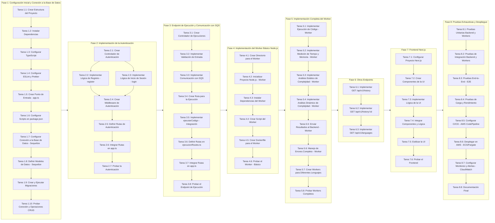

# Roadmap de Desarrollo

**Fase 1: Configuración Inicial y Conexión a la Base de Datos**

*   **\[Tarea 1.1\] Crear Estructura del Proyecto**
    
    *   **Descripción:** Crear la estructura de directorios y archivos base para el proyecto backend. Esto incluye:
        
        *   Inicializar el proyecto Node.js (npm init -y o yarn init -y).
            
        *   Crear las carpetas: src, src/controllers, src/models, src/services (opcional), src/routes, src/middleware, src/utils, src/config, src/types (opcional), tests.
            
        *   Crear archivos base: package.json, .gitignore, .env.example.
            
    *   **Entregables:** Estructura de directorios creada, package.json inicializado, archivos base creados.
        
    *   **Dependencias:** Ninguna.
        
*   **\[Tarea 1.2\] Instalar Dependencias**
    
    *   **Descripción:** Instalar todas las dependencias de desarrollo y producción necesarias para el backend. Esto incluye:
        
        *   **Producción:** express, pg, pg-hstore, sequelize, jsonwebtoken, bcrypt, dotenv, express-rate-limit, winston (o bunyan/pino).
            
        *   **Desarrollo:** typescript, @types/node, @types/express, @types/bcrypt, @types/jsonwebtoken, @types/pg, @types/sequelize, @types/express-rate-limit, nodemon, ts-node, jest, supertest, @types/jest, @types/supertest, eslint, prettier, eslint-config-prettier, eslint-plugin-prettier, @typescript-eslint/parser, @typescript-eslint/eslint-plugin.
            
    *   **Entregables:** 1 Archivo package.json actualizado con las dependencias instaladas, carpeta node\_modules creada.   
        
    *   **Dependencias:** Tarea 1.1.
        
*   **\[Tarea 1.3\] Configurar TypeScript**
    
    *   **Descripción:** Crear y configurar el archivo tsconfig.json para definir las opciones de compilación de TypeScript, incluyendo el directorio de origen (rootDir), el directorio de salida (outDir), el nivel de ECMAScript (target), la resolución de módulos (module), habilitar la interoperabilidad con CommonJS (esModuleInterop), habilitar la comprobación estricta (strict), etc.
        
    *   **Entregables:** Archivo tsconfig.json configurado.
        
    *   **Dependencias:** Tarea 1.2.
        
*   **\[Tarea 1.4\] Configurar ESLint y Prettier**
    
    *   **Descripción:** Configurar ESLint y Prettier para mantener un estilo de código consistente, detectar errores de forma temprana y formatear el código automáticamente. Crear los archivos .eslintrc.js y .prettierrc.js.
        
    *   **Entregables:** Archivos .eslintrc.js y .prettierrc.js configurados.
        
    *   **Dependencias:** Tarea 1.2.
        
*   **\[Tarea 1.5\] Crear Punto de Entrada (app.ts)**
    
    *   **Descripción:** Crear el archivo app.ts que servirá como punto de entrada principal de la aplicación Express. Inicializar una instancia de Express, configurar un endpoint básico (/) que responda con un mensaje de prueba, y poner la aplicación a escuchar en un puerto (usando variables de entorno).
        
    *   **Entregables:** Archivo app.ts creado y funcional (la aplicación se inicia y responde en el puerto especificado).
        
    *   **Dependencias:** Tarea 1.2.
        
*   **\[Tarea 1.6\] Configurar Scripts en package.json**
    
    *   **Descripción:** Añadir scripts al archivo package.json para:
        
        *   Iniciar el servidor en modo desarrollo (dev): nodemon src/app.ts.
            
        *   Iniciar el servidor en producción (start): node dist/app.js.
            
        *   Construir el código TypeScript (build): tsc.
            
        *   Ejecutar pruebas (test): jest.
            
        *   Ejecutar ESLint (lint): eslint . --ext .ts.
            
        *   Formatear el código con Prettier (format): prettier --write ..
            
        *   Ejecutar migraciones (up, down, create): sequelize db:migrate, sequelize db:migrate:undo, sequelize migration:generate --name.
            
    *   **Entregables:** Scripts configurados en package.json.
        
    *   **Dependencias:** Tarea 1.1.
        
*   **\[Tarea 1.7\] Configurar Conexión a la Base de Datos (Sequelize)**
    
    *   **Descripción:**
        
        *   Crear el archivo de configuración para Sequelize (src/config/database.ts).
            
        *   Configurar la conexión a la base de datos PostgreSQL utilizando variables de entorno (.env) para los datos sensibles (host, usuario, contraseña, nombre de la base de datos, puerto).
            
        *   Crear una instancia de Sequelize.
            
        *   Exportar la instancia de Sequelize.
            
        *   Configurar Sequelize CLI (crear config/config.js para sequelize-cli).
            
    *   **Entregables:** Archivo src/config/database.ts creado y configurado, conexión a la base de datos probada, archivo config/config.js creado.
        
    *   **Dependencias:** Tarea 1.2.
        
*   **\[Tarea 1.8\] Definir Modelos de Datos (Sequelize)**
    
    *   **Descripción:**
        
        *   Crear los modelos de datos Sequelize para las tablas usuarios y ejecuciones (src/models/Usuario.ts y src/models/Ejecucion.ts).
            
        *   Definir los atributos (columnas), tipos de datos, restricciones (NOT NULL, UNIQUE, etc.) y relaciones (belongsTo, hasMany) entre los modelos.
            
        *   Importar y utilizar la instancia de Sequelize creada en src/config/database.ts.
            
    *   **Entregables:** Archivos de modelos (src/models/Usuario.ts y src/models/Ejecucion.ts) creados y configurados.
        
    *   **Dependencias:** Tarea 1.7.
        
*   **\[Tarea 1.9\] Crear y Ejecutar Migraciones**
    
    *   **Descripción:**
        
        *   Crear los archivos de migración de Sequelize para crear las tablas usuarios y ejecuciones en la base de datos (usando sequelize migration:generate).
            
        *   Escribir el código de las migraciones (ya lo tenemos del documento de modelado de la base de datos).
            
        *   Ejecutar las migraciones (npm run migrate:up o yarn migrate:up).
            
    *   **Entregables:** Tablas usuarios y ejecuciones creadas en la base de datos.
        
    *   **Dependencias:** Tarea 1.8.
        
*   **\[Tarea 1.10\] Probar Conexión y Operaciones CRUD**
    
    *   **Descripción:** Crear un script simple (en src/app.ts o en un archivo separado) para probar la conexión a la base de datos y realizar operaciones CRUD básicas (crear un usuario, buscar un usuario, crear una ejecución, buscar ejecuciones, etc.) utilizando los modelos de Sequelize.
        
    *   **Entregables:** Script de prueba creado y ejecutado con éxito (se verifica que se pueden realizar operaciones CRUD en la base de datos).
        
    *   **Dependencias:** Tarea 1.9.
        

**Fase 2: Implementación de la Autenticación**

*   **\[Tarea 2.1\] Crear Controlador de Autenticación**
    
    *   **Descripción:** Crear el archivo src/controllers/authController.ts que contendrá las funciones controladoras para el registro (register) y el inicio de sesión (login).
        
    *   **Entregables:** Archivo src/controllers/authController.ts creado.
        
    *   **Dependencias:** Tarea 1.1.
        
*   **\[Tarea 2.2\] Implementar Lógica de Registro (register)**
    
    *   **Descripción:** Implementar la función register en authController.ts. Esta función debe:
        
        *   Recibir los datos del usuario (username, email, password) en el cuerpo de la solicitud (req.body).
            
        *   Validar los datos de entrada (usar express-validator).
            
        *   Verificar si el email ya está registrado (consultando la base de datos con el modelo Usuario).
            
        *   Hashear la contraseña usando bcrypt.
            
        *   Crear un nuevo registro de usuario en la base de datos (usando el modelo Usuario).
            
        *   Responder con un mensaje de éxito y el ID del usuario creado (status code 201 Created), o con un error apropiado (400, 409, 500).
            
    *   **Entregables:** Función register implementada y funcionando.
        
    *   **Dependencias:** Tarea 2.1, Tarea 1.8.
        
*   **\[Tarea 2.3\] Implementar Lógica de Inicio de Sesión (login)**
    
    *   **Descripción:** Implementar la función login en authController.ts. Esta función debe:
        
        *   Recibir el email y la contraseña en el cuerpo de la solicitud (req.body).
            
        *   Validar los datos de entrada (usar express-validator).
            
        *   Buscar al usuario por email en la base de datos (usando el modelo Usuario).
            
        *   Si el usuario no existe, retornar un error 401 Unauthorized.
            
        *   Verificar si la contraseña proporcionada coincide con el hash de la contraseña almacenada (usando bcrypt.compare).
            
        *   Si la contraseña es incorrecta, retornar un error 401 Unauthorized.
            
        *   Generar un token JWT (usando jsonwebtoken) que incluya el ID del usuario en el payload.
            
        *   Responder con el token JWT (status code 200 OK).
            
    *   **Entregables:** Función login implementada y funcionando.
        
    *   **Dependencias:** Tarea 2.1, Tarea 1.8.
        
*   **\[Tarea 2.4\] Crear Middleware de Autenticación**
    
    *   **Descripción:** Crear un middleware (src/middleware/authMiddleware.ts) que verifique la autenticidad del token JWT en las solicitudes a endpoints protegidos. Este middleware debe:
        
        *   Obtener el token JWT del header Authorization (formato: Bearer ).
            
        *   Si no se proporciona el token, retornar un error 401 Unauthorized.
            
        *   Verificar el token usando jsonwebtoken.verify y la clave secreta (definida en una variable de entorno).
            
        *   Si el token es inválido o ha expirado, retornar un error 401 Unauthorized.
            
        *   Si el token es válido, decodificar el token, obtener el ID del usuario del payload, y añadir el ID del usuario al objeto req (por ejemplo, req.userId).
            
        *   Llamar a next() para pasar el control al siguiente middleware o al controlador.
            
        *   Extender la interface Request global de Express para que reconozca la propiedad userId.
            
    *   **Entregables:** Middleware authMiddleware.ts creado y funcionando.
        
    *   **Dependencias:** Tarea 1.2.
        
*   **\[Tarea 2.5\] Definir Rutas de Autenticación**
    
    *   **Descripción:** Crear el archivo src/routes/authRoutes.ts. Definir las rutas POST /api/v1/auth/register (asociada a authController.register) y POST /api/v1/auth/login (asociada a authController.login).
        
    *   **Entregables:** Archivo src/routes/authRoutes.ts creado.
        
    *   **Dependencias:** Tarea 2.1.
        
*   **\[Tarea 2.6\] Integrar Rutas en app.ts**
    
    *   **Descripción:** Importar las rutas de autenticación (authRoutes) en app.ts y usarlas con app.use('/api/v1/auth', authRoutes).
        
    *   **Entregables:** Rutas de autenticación integradas y funcionales.
        
    *   **Dependencias:** Tarea 2.5, Tarea 1.5
        
*   **\[Tarea 2.7\] Probar la Autenticación**
    
    *   **Descripción:** Usar Postman (o una herramienta similar) para probar los endpoints /api/v1/auth/register y /api/v1/auth/login. Verificar que:
        
        *   Se pueden registrar nuevos usuarios.
            
        *   Se pueden iniciar sesión con credenciales válidas y se recibe un token JWT.
            
        *   Se reciben errores 401 si las credenciales son inválidas o si no se proporciona un token.
            
        *   Se reciben errores 409 si se intenta registrar un usuario con un email ya existente.
            
        *   Se reciben errores 400 si los datos de entrada son inválidos.
            
    *   **Entregables:** Endpoints de autenticación probados y funcionando correctamente.
        
    *   **Dependencias:** Tareas 2.2, 2.3, 2.6.
        

**Fase 3: Implementación del Endpoint de Ejecución y Comunicación con SQS**

*   **\[Tarea 3.5\] Implementar ejecutarCodigo (Integración)**
    
    *   **Descripción:** Combinar la lógica de las Tareas 3.2, 3.3 y 3.4 en la función ejecutarCodigo dentro de src/controllers/ejecucionController.ts.
        
    *   **Entregables:** Controlador ejecutarCodigo completamente implementado.
        
    *   **Dependencias:** Tareas 3.2, 3.3.
        
*   **\[Tarea 3.6\] Integrar Rutas en app.ts**
    
    *   **Descripción:** Importar ejecucionRoutes en app.ts y usarlo con app.use('/api/v1', ejecucionRoutes).
        
    *   **Entregable:** Ruta /api/v1/execute funcional.
        
    *   **Dependencias:** Tarea 3.4, Tarea 1.5.
        
*   **\[Tarea 3.7\] Probar el Endpoint de Ejecución**
    

*   **Descripción:** Usar Postman (o una herramienta similar) para enviar una solicitud POST /api/v1/execute con un cuerpo JSON que contenga el language, code e input (opcional).
    
    *   Verificar que se recibe una respuesta 202 Accepted.
        
    *   Verificar que el mensaje se encola correctamente en SQS (usando la consola de AWS).
        
    *   Verificar que, si se envía un token JWT válido en el header Authorization, el userId se incluye en el mensaje enviado a SQS.
        
    *   Verificar que, si no se envía un token JWT (o si es inválido), la ejecución se encola sin userId (o con userId a null, según la lógica que se haya definido).
        
    *   Verificar que se reciben errores 400 Bad Request si los datos de entrada son inválidos (lenguaje no soportado, código vacío, etc.).
        
    *   Verificar que se reciben errores 401 Unauthorized si se requiere autenticación y el token es inválido o no se proporciona.
        
*   **Entregables:** Endpoint /api/v1/execute probado y funcionando correctamente.
    
*   **Dependencias:** Tareas 3.5, 3.6.

  **Fase 4: Implementación del Worker Básico (Node.js)**
    
*   **\[Tarea 4.1\] Crear Directorio para el Worker**
    

*   **Descripción:** Crear un directorio separado para el código del worker (por ejemplo, argus-worker-js). Esto ayuda a mantener una separación clara entre el backend y los workers.
    
*   **Entregables:** Directorio argus-worker-js creado.
    
*   **Dependencias:** Ninguna.
    
*   **\[Tarea 4.2\] Inicializar Proyecto Node.js (Worker)**
    
    *   **Descripción:** Dentro del directorio del worker, inicializar un nuevo proyecto Node.js (npm init -y o yarn init -y).
        
    *   **Entregables:** Archivo package.json creado en el directorio del worker.
        
    *   **Dependencias:** Tarea 4.1.
        
*   **\[Tarea 4.3\] Instalar Dependencias del Worker**
    
    *   **Descripción:** Instalar las dependencias necesarias para el worker: aws-sdk (para interactuar con SQS). Si se usa TypeScript, instalar también typescript y @types/node como dependencias de desarrollo.
        
    *   **Entregables:** Dependencias instaladas y reflejadas en package.json del worker.
        
    *   **Dependencias:** Tarea 4.2.
        
*   **\[Tarea 4.4\] Crear Script del Worker**
    
    *   **Descripción:** Crear el archivo principal del worker (worker.ts o worker.js). Este script debe:
        
        *   Importar el cliente de SQS de aws-sdk.
            
        *   Configurar las credenciales de AWS (usando variables de entorno).
            
        *   Crear una instancia del cliente de SQS.
            
        *   Implementar un bucle infinito que:
            
            *   Reciba mensajes de la cola SQS especificada (usando sqs.receiveMessage con long-polling).
                
            *   Parse el mensaje JSON recibido.
                
            *   Extraiga la información relevante (code, language, input, executionId, userId).
                
            *   _Por ahora_, simplemente imprima la información recibida en la consola (para verificar que la comunicación con SQS funciona). La ejecución real del código se implementará en fases posteriores.
                
            *   Elimine el mensaje de la cola SQS (usando sqs.deleteMessage) una vez procesado.
                
            *   Maneje posibles errores (errores de conexión a SQS, errores al parsear el mensaje, etc.).
                
            *   _(Opcional, pero recomendado)_ Implementar un mecanismo de _backoff_ exponencial para los reintentos en caso de errores de SQS.
                
    *   **Entregables:** Script del worker (worker.ts o worker.js) creado y funcionando (recibe mensajes de SQS y los imprime en la consola).
        
    *   **Dependencias:** Tarea 4.3.
        
*   **\[Tarea 4.5\] Crear Dockerfile para el Worker**
    
    *   **Descripción:** Crear un Dockerfile para el worker. Este archivo debe:
        
        *   Usar una imagen base de Node.js (por ejemplo, node:18-alpine).
            
        *   Definir el directorio de trabajo dentro del contenedor (WORKDIR).
            
        *   Copiar el archivo package.json y el archivo package-lock.json (o yarn.lock) al contenedor.
            
        *   Instalar las dependencias (RUN npm install o RUN yarn install).
            
        *   Copiar el código fuente del worker al contenedor (COPY . .).
            
        *   Definir el comando de inicio para ejecutar el script del worker (CMD \["npm", "start"\] o CMD \["node", "worker.js"\]). Asegúrate de que el script start en package.json del worker ejecute el script principal (worker.ts o worker.js). Si usas TypeScript, el script start debe compilar el código TypeScript a JavaScript y luego ejecutar el archivo JavaScript resultante (por ejemplo, tsc && node worker.js).
            
        *   Definir las variables de entorno (usar ENV)
            
    *   **Entregables:** Dockerfile creado para el worker.
        
    *   **Dependencias:** Tarea 4.4.
        
*   **\[Tarea 4.6\] Probar el Worker (Básico)**
    
    *   **Descripción:**
        
        *   Construir la imagen Docker del worker (docker build -t argus-worker-js .).
            
        *   Ejecutar el contenedor Docker (docker run argus-worker-js). Asegúrate de pasar las variables de entorno necesarias (AWS credentials, SQS queue URL, etc.) al contenedor usando la opción -e de docker run. Por ejemplo: docker run -e AWS\_ACCESS\_KEY\_ID=$AWS\_ACCESS\_KEY\_ID -e AWS\_SECRET\_ACCESS\_KEY=$AWS\_SECRET\_ACCESS\_KEY -e AWS\_REGION=$AWS\_REGION -e SQS\_QUEUE\_URL=$SQS\_QUEUE\_URL argus-worker-js.
            
        *   Enviar un mensaje de prueba a la cola SQS (puedes usar la consola de AWS o un script).
            
        *   Verificar que el worker recibe el mensaje y lo imprime en la consola.
            
        *   Verificar en Cloudwatch los logs.
            
    *   **Entregables:** Worker básico funcionando (recibe mensajes de SQS y los imprime).
        
    *   **Dependencias:** Tareas 4.4, 4.5.
        
  **Fase 5: Implementación Completa del Worker (Node.js/Python)**
    

*   **\[Tarea 5.1\] Implementar Ejecución de Código (Worker)**
    
*   **Descripción:** Modificar el script del worker para ejecutar el código recibido en el mensaje de SQS. Esto implica:
    
    *   Crear un archivo temporal con el código recibido (por ejemplo, code.js o code.py).
        
    *   Si se proporciona un input, crear un archivo temporal con el input (por ejemplo, input.txt).
        
    *   Usar child\_process.exec (Node.js) o subprocess.run (Python) para ejecutar el código en un subproceso separado.
        
    *   Capturar la salida estándar (stdout) y el error estándar (stderr) del subproceso.
        
    *   Establecer un tiempo máximo de ejecución (timeout) para evitar bucles infinitos o procesos que consuman demasiados recursos.
        
    *   Usar un _sandbox_ (entorno aislado, como ya hace Docker)
        
*   **Entregables:** Worker ejecuta el código recibido y captura stdout/stderr.
    
*   **Dependencias:** Tarea 4.4.
    
*   **\[Tarea 5.2\] Implementar Medición de Tiempo y Memoria (Worker)**
    
    *   **Descripción:** Modificar el script del worker para medir el tiempo de ejecución y el uso de memoria del código ejecutado.
        
        *   **Tiempo:**
            
            *   **Node.js:** Usar performance.now() antes y después de la ejecución del código para obtener el tiempo transcurrido en milisegundos.
                
            *   **Python:** Usar time.perf\_counter() o time.time() antes y después de la ejecución.
                
        *   **Memoria:**
            
            *   **Node.js:** Usar process.memoryUsage().heapUsed para obtener el uso de memoria del heap de V8 (en bytes). Para una medición más precisa, considerar el uso de herramientas de profiling (más complejo).
                
            *   **Python:** Usar tracemalloc para rastrear las asignaciones de memoria y obtener el pico de uso de memoria, o memory\_profiler para un perfil más detallado. También se puede usar resource.getrusage(resource.RUSAGE\_SELF).ru\_maxrss (en sistemas Unix-like) para obtener el uso máximo de memoria residente (en kilobytes).
                
    *   **Entregables:** Worker mide el tiempo de ejecución y el uso de memoria.
        
    *   **Dependencias:** Tarea 5.1.
        
*   **\[Tarea 5.3\] Implementar Análisis Estático de Complejidad (Worker)**
    
    *   **Descripción:** Implementar el análisis estático del código para estimar la complejidad algorítmica (Big O).
        
        *   **Node.js:** Usar esprima para parsear el código JavaScript en un Árbol de Sintaxis Abstracta (AST).
            
        *   **Python:** Usar el módulo ast para parsear el código Python en un AST.
            
        *   Recorrer el AST para identificar estructuras de control de flujo (bucles for, while, recursión) y sus anidamientos.
            
        *   Analizar llamadas a funciones y su posible complejidad (si se tiene información sobre ellas). Se puede crear una base de datos o un archivo de configuración con la complejidad de funciones comunes (por ejemplo, Array.prototype.sort en JavaScript es O(n log n)).
            
        *   Detectar patrones comunes que sugieran complejidades típicas (O(n), O(n log n), O(n^2), etc.).
            
        *   Generar una _estimación_ de la complejidad en tiempo y espacio. Dejar claro que es una estimación y no un cálculo exacto.
            
    *   **Entregables:** Worker estima la complejidad algorítmica (estática).
        
    *   **Dependencias:** Tarea 5.1.
        
*   **\[Tarea 5.4\] Implementar Análisis Dinámico de Complejidad (Worker)**
    
    *   **Descripción:** Implementar el análisis dinámico del código para refinar la estimación de la complejidad algorítmica.
        
        *   Instrumentar el código _antes_ de ejecutarlo. Esto implica añadir contadores a las estructuras de control de flujo (bucles, condicionales, etc.). La instrumentación se puede hacer modificando el AST o añadiendo código directamente al string del código fuente (menos recomendado).
            
        *   Ejecutar el código instrumentado.
            
        *   Después de la ejecución, obtener los valores de los contadores.
            
        *   Relacionar los valores de los contadores con el tamaño del input (si se proporciona) para inferir la complejidad. Por ejemplo, si el número de iteraciones de un bucle es aproximadamente igual al tamaño del input, se puede inferir una complejidad O(n). Si el numero de iteraciones es proporcional al cuadrado del input, O(n^2).
            
    *   **Entregables:** Worker realiza análisis dinámico de complejidad.
        
    *   **Dependencias:** Tarea 5.1, Tarea 5.3 (la instrumentación puede usar el AST).
        
*   **\[Tarea 5.5\] Enviar Resultados al Backend (Worker)**
    
    *   **Descripción:** Modificar el script del worker para enviar los resultados de la ejecución al backend. Los resultados deben incluir:
        
        *   executionId: El identificador único de la ejecución.
            
        *   execution\_time\_ms: El tiempo de ejecución en milisegundos.
            
        *   memory\_usage\_kb: El uso máximo de memoria en kilobytes.
            
        *   complexity\_time: La complejidad temporal estimada (Big O).
            
        *   complexity\_space: La complejidad espacial estimada (Big O).
            
        *   output: La salida estándar (stdout) del código.
            
        *   error: El error estándar (stderr) del código (si lo hay).
            
        *   userId: El ID del usuario (si se proporcionó en el mensaje original).
            
    *   Hay dos opciones principales para enviar los resultados:
        
        1.  **A través de otra cola SQS (Recomendado):** Crear una nueva cola SQS (por ejemplo, argus-results-queue). El worker envía un mensaje a esta cola con los resultados. El backend escucha en esta cola y procesa los resultados (guardándolos en la base de datos).
            
        2.  **Directamente a la API del backend:** El worker realiza una solicitud HTTP POST a un endpoint específico del backend (por ejemplo, /api/v1/results). Esta opción es menos escalable y acopla más el worker al backend.
            
    *   **Entregables:** Worker envía los resultados de la ejecución al backend.
        
    *   **Dependencias:** Tareas 5.1, 5.2, 5.3, 5.4.
        
*   **\[Tarea 5.6\] Manejo de Errores Completo (Worker)**
    
    *   **Descripción:** Implementar un manejo de errores robusto en el worker. Esto incluye:
        
        *   Capturar _todas_ las excepciones que puedan ocurrir durante la recepción del mensaje, la preparación del entorno, la ejecución del código, la medición del rendimiento, el análisis de complejidad y el envío de resultados.
            
        *   Registrar los errores (usando console.error o un sistema de logging).
            
        *   Si ocurre un error, enviar un mensaje de error al backend (en lugar de los resultados de la ejecución). El mensaje de error debe incluir el executionId y una descripción del error.
            
        *   Manejar el caso en que el tiempo de ejecución del código exceda el timeout. Matar el subproceso y enviar un mensaje de error indicando que se excedió el tiempo máximo de ejecución.
            
        *   Implementar una política de reintentos para errores transitorios (por ejemplo, errores de conexión a SQS).
            
    *   **Entregables:** Worker maneja errores de forma robusta y envía mensajes de error al backend.
        
    *   **Dependencias:** Tareas 5.1, 5.5.
        
*   **\[Tarea 5.7\] Crear Workers para Diferentes Lenguajes**
    
    *   **Descripción:** Repetir las Tareas 5.1 a 5.6, creando workers separados para cada lenguaje de programación soportado (por ejemplo, argus-worker-python, argus-worker-java, etc.). Cada worker tendrá su propio Dockerfile y su propia lógica de ejecución y medición, adaptada al lenguaje específico.
        
    *   **Entregables:** Workers para cada lenguaje soportado, funcionando correctamente.
        
    *   **Dependencias:** Tareas 5.1 a 5.6.
        
*   **\[Tarea 5.8\] Probar Workers Completos**
    
    *   **Descripción**: Probar exhaustivamente los workers.
        
    *   **Entregables**: Workers funcionando y probados.
        
    *   **Dependencias:** Tareas 5.1 a 5.7.
        
  **Fase 6: Otros Endpoints**
    
*   **\[Tarea 6.1\] Implementar GET /api/v1/history**
    

*   **Descripción:** Implementar el endpoint para obtener el historial de ejecuciones de un usuario.
    
    *   Crear el controlador y la ruta correspondientes.
        
    *   Usar el middleware de autenticación (authenticateJWT) para obtener el userId del token.
        
    *   Consultar la base de datos (tabla ejecuciones) para obtener las ejecuciones asociadas al userId.
        
    *   Ordenar los resultados por fecha de creación (descendente).
        
    *   Responder con un array de objetos, cada uno representando una ejecución (con los campos relevantes).
        
*   **Entregables:** Endpoint /api/v1/history implementado y funcionando.
    
*   **Dependencias:** Tarea 2.4, Tarea 1.8
    
*   **\[Tarea 6.2\] Implementar GET /api/v1/history/{id}**
    
    *   **\[Tarea 6.3\] Implementar GET /api/v1/languages**
        
    
    *   **Descripción:** Implementar el endpoint para obtener la lista de lenguajes soportados.
        
        *   Crear el controlador y la ruta correspondientes.
            
        *   Este endpoint no requiere autenticación.
            
        *   Definir un array con los lenguajes soportados (por ejemplo, \['javascript', 'python'\]). En el futuro, esta lista podría obtenerse de una base de datos o de un archivo de configuración.
            
        *   Responder con un objeto JSON que contenga la lista de lenguajes.
            
    *   **Entregables:** Endpoint /api/v1/languages implementado y funcionando.
        
    *   **Dependencias:** Ninguna (es un endpoint muy simple).
        
      **Fase 7: Frontend (Next.js)**

*   **[Tarea 7.1] Configurar Proyecto Next.js**
    *   **Descripción:** Crear un nuevo proyecto Next.js utilizando `npx create-next-app argus-frontend`. Instalar las dependencias necesarias, como `axios` (para las peticiones HTTP), `react-ace` o `CodeMirror` (para el editor de código), y `recharts` o `Chart.js` (para las gráficas, si se utilizan). También, instalar las dependencias para el manejo del estado si se decide usar algo diferente al Context API de React.
    *   **Entregables:** Proyecto Next.js inicializado y configurado con las dependencias básicas instaladas.

*   **[Tarea 7.2] Crear Componentes de la UI**
    *   **Descripción:** Crear los componentes React necesarios para la interfaz de usuario.  Esto incluye, como mínimo:
        *   `CodeEditor`: Componente para el editor de código (con resaltado de sintaxis).
        *   `LanguageSelector`: Componente para seleccionar el lenguaje de programación (un dropdown o similar).
        *   `InputForm`: Componente para ingresar el input del código (opcional, puede ser un simple textarea o un componente más complejo según el tipo de input).
        *   `ResultsTable`: Componente para mostrar los resultados de la ejecución en formato de tabla (tiempo, memoria, complejidad, output, error).
        *   `ResultsChart`: Componente para mostrar los resultados en formato de gráfica (opcional, para visualizaciones más avanzadas).
        *   `LoginForm`: Componente para el formulario de inicio de sesión.
        *   `RegisterForm`: Componente para el formulario de registro.
        *   `HistoryTable`: Componente para mostrar el historial de ejecuciones del usuario.
        *   `Layout`: Componente para el layout general de la aplicación (barra de navegación, encabezado, pie de página, etc.).
        *  `Loader`: Componente que muestre un *spinner* o similar.
    *   **Entregables:** Archivos de componentes React creados (`.tsx` o `.jsx`), con la estructura básica de cada componente (sin lógica ni estilos, solo la estructura JSX).
    * **Dependencias:** Tarea 7.1

*   **[Tarea 7.3] Implementar Lógica de la UI**
    *   **Descripción:** Implementar la lógica para interactuar con la API del backend y manejar el estado de la aplicación.  Esto incluye:
        *   Crear funciones para realizar las peticiones HTTP a los endpoints de la API (usando `axios` o `fetch`):
            *   `executeCode`: Envía el código, lenguaje e input al endpoint `/api/v1/execute`.
            *   `getHistory`: Obtiene el historial de ejecuciones del usuario (autenticado) desde `/api/v1/history`.
            *   `getExecutionDetails`: Obtiene los detalles de una ejecución específica desde `/api/v1/history/{id}`.
            *   `getLanguages`: Obtiene la lista de lenguajes soportados desde `/api/v1/languages`.
            *   `registerUser`: Envía los datos de registro al endpoint `/api/v1/auth/register`.
            *   `loginUser`: Envía las credenciales de inicio de sesión al endpoint `/api/v1/auth/login`.
        *   Manejar el estado de la aplicación:
            *   Decidir si usar el Context API de React, Zustand, Redux, o otra solución de manejo de estado.
            *   Almacenar el token JWT (obtenido al iniciar sesión) en el estado de la aplicación (o en `localStorage` o en una cookie).
            *   Almacenar la información del usuario autenticado (ID, username, email).
            *   Almacenar el historial de ejecuciones.
            *   Almacenar el estado de carga (loading) mientras se realizan las peticiones a la API.
            *   Almacenar los errores.
        *   Manejar los errores de las peticiones a la API (mostrar mensajes de error al usuario).
        *   Implementar la redirección después del inicio de sesión y el registro.
        *   Implementar la lógica para mostrar/ocultar elementos de la UI según el estado de autenticación del usuario (por ejemplo, mostrar el botón de "Iniciar Sesión" si el usuario no está autenticado, y mostrar el botón de "Cerrar Sesión" y el historial si está autenticado).

    *   **Entregables:** Funciones para interactuar con la API creadas, lógica de manejo de estado implementada, manejo de errores implementado.
    *   **Dependencias:** Tarea 7.1, y tener el Backend funcional (al menos las Fases 1-3).

*   **[Tarea 7.4] Integrar Componentes y Lógica**
    *   **Descripción:** Conectar los componentes de la UI creados en la Tarea 7.2 con la lógica implementada en la Tarea 7.3.  Esto incluye:
        *   Pasar las funciones de la API como props a los componentes que las necesiten.
        *   Llamar a las funciones de la API desde los componentes (por ejemplo, cuando el usuario hace clic en el botón de "Ejecutar").
        *   Actualizar el estado de la aplicación con los resultados de las peticiones a la API.
        *   Mostrar los datos del estado en los componentes (por ejemplo, mostrar el tiempo de ejecución, la memoria utilizada, etc., en `ResultsTable`).
        *   Manejar los eventos de los componentes (onChange, onClick, onSubmit).
        *   Implementar la navegación entre las diferentes páginas/vistas de la aplicación (usando `next/router` o `react-router-dom`).
    *   **Entregables:** Componentes de la UI conectados a la lógica y funcionando correctamente (la aplicación es interactiva y se comunica con el backend).
    *   **Dependencias:** Tareas 7.2, 7.3.

*   **[Tarea 7.5] Estilizar la UI**
    *   **Descripción:** Añadir estilos CSS a la aplicación para que sea visualmente atractiva y fácil de usar.  Se puede usar:
        *   CSS puro.
        *   CSS Modules.
        *   Styled Components.
        *   Un framework CSS (Tailwind CSS, Material UI, Bootstrap, etc.).
        *   Sass/SCSS.
    *   **Entregables:** Aplicación con estilos CSS aplicados.
    *   **Dependencias:** Tarea 7.2.

*   **[Tarea 7.6] Probar el Frontend**
    *   **Descripción:** Escribir pruebas unitarias e de integración para los componentes y la lógica del frontend.
        *   Usar Jest y React Testing Library para las pruebas unitarias y de integración.
        *   Probar la renderización de los componentes.
        *   Probar la interacción de los componentes con la lógica (simulando las peticiones a la API con mocks).
        *   Probar el manejo de errores.
        *   Probar la navegación.
        *  *(Opcional)* Pruebas End-to-End con Cypress, Playwright.

    *   **Entregables:** Pruebas unitarias e de integración para el frontend escritas y pasando.
    *  **Dependencias:** Tareas 7.2, 7.3, 7.4

**Fase 8: Pruebas Exhaustivas y Despliegue**

*   **[Tarea 8.1] Pruebas Unitarias (Backend y Workers)**
    *   **Descripción:** Escribir pruebas unitarias para cada función y componente del backend y de los workers.  Usar Jest (o Mocha/Chai) para las pruebas.  Asegurarse de cubrir todos los casos de uso y los casos de error (validaciones, errores de base de datos, errores de red, etc.).  Usar mocks para aislar las unidades de código que se están probando (por ejemplo, simular la conexión a la base de datos, la comunicación con SQS, etc.).
    *   **Entregables:** Pruebas unitarias completas para el backend y los workers, con una buena cobertura de código.
    * **Dependencias:** Fases 1-6 completas.

*   **[Tarea 8.2] Pruebas de Integración (Backend y Workers)**
    *   **Descripción:** Escribir pruebas de integración para verificar la interacción entre los diferentes componentes del backend (controladores, servicios, modelos, base de datos, cola de mensajes) y entre el backend y los workers.  Usar Jest y Supertest para las pruebas de integración de la API.  Para las pruebas que involucren SQS, se puede usar una instancia local de SQS (como LocalStack) o mocks.
    *   **Entregables:** Pruebas de integración completas para el backend y los workers.
    * **Dependencias:** Fases 1-6 completas.

*   **[Tarea 8.3] Pruebas End-to-End (E2E)**
    *   **Descripción:** Escribir pruebas end-to-end para simular el flujo completo de un usuario en la aplicación, desde el frontend (interfaz de usuario) hasta el backend, los workers y la base de datos.  Usar Cypress, Playwright o Puppeteer para las pruebas E2E.  Estas pruebas deben interactuar con la aplicación como lo haría un usuario real (haciendo clic en botones, escribiendo en campos de texto, etc.) y verificar que los resultados sean los esperados.
    *   **Entregables:** Pruebas E2E completas.
     * **Dependencias:** Fases 1-7 completas.

*   **[Tarea 8.4] Pruebas de Carga y Rendimiento**
    *   **Descripción:** Realizar pruebas de carga y rendimiento para verificar la escalabilidad y la capacidad de respuesta de la aplicación bajo diferentes niveles de carga (número de usuarios concurrentes, número de solicitudes por segundo, etc.).  Usar herramientas como Artillery, k6 o JMeter.  Estas pruebas deben medir:
        *   Tiempo de respuesta promedio.
        *   Tasa de errores.
        *   Uso de CPU y memoria del backend y de los workers.
        *   Número máximo de usuarios concurrentes que la aplicación puede soportar.
        *  Identificar cuellos de botella.
    *   **Entregables:** Resultados de las pruebas de carga y rendimiento, identificando posibles cuellos de botella y límites de la aplicación.
     * **Dependencias:** Fases 1-6 completas.

*   **[Tarea 8.5] Configurar CI/CD (AWS CodePipeline)**
    *   **Descripción:** Configurar un pipeline de Integración Continua y Entrega Continua (CI/CD) usando AWS CodePipeline, CodeBuild y CodeDeploy (o herramientas equivalentes como Jenkins, GitLab CI, CircleCI, GitHub Actions, etc.). El pipeline debe:
        *   Detectar cambios en el repositorio de código (GitHub, GitLab, Bitbucket, etc.).
        *   Ejecutar las pruebas unitarias, de

   
